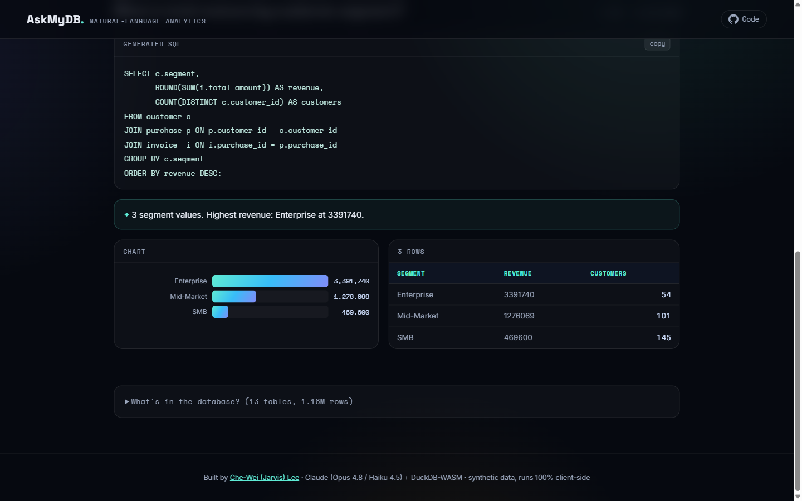

# AskMyDB — Natural-Language SQL Analytics

Ask a business question in plain English; **Claude writes the SQL** and **DuckDB-WASM runs it entirely in your browser** against a realistic **1.16M-row, 13-table** AWS-reseller data warehouse. No backend, no server cost.

**▶ Live demo:** https://jarvislee511.github.io/nl2sql-analytics-assistant/



---

## What it does

- **Curated questions (free, instant):** click an example — the pre-generated, hand-verified SQL runs in-browser via DuckDB-WASM and renders a result table, an auto-selected chart, and a one-line summary.
- **Free-form (bring your own Claude key):** type any question. **Claude Opus 4.8** generates the SQL; read-only guardrails validate it (SELECT-only, single statement, no DDL/DML); DuckDB-WASM executes it; **Claude Haiku 4.5** writes a plain-language summary of the result.
- Every result shows the **generated SQL** for transparency.

## Why this architecture

| Goal | How |
|---|---|
| **$0 to host & run** | Static site on GitHub Pages; the database + queries run client-side in **DuckDB-WASM** — no server, no per-query API cost for visitors |
| **Accurate in front of recruiters** | The demo's example SQL is hand-authored and **verified against the warehouse** (13/13 pass); free-form uses the strongest model (Opus 4.8) |
| **Demonstrably an LLM system** | Free-form genuinely calls Claude; an evaluation harness measures it (below) |
| **Safe** | Read-only SQL guardrails; the user's API key stays in their browser tab and is sent only to Anthropic |

## Tech

`DuckDB-WASM` · `Claude API (Opus 4.8 + Haiku 4.5)` · vanilla JS/HTML/CSS · `Python + DuckDB` (data generation & eval) · `Parquet`

## The data (synthetic, reproducible)

A procurement/billing warehouse for a fictional AWS reseller — 13 related tables, **1.16M rows**, generated with realistic patterns: YoY revenue growth + seasonality, customer segments (Enterprise/Mid-Market/SMB), ~12% churn, ~12% overdue invoices (AR aging), support-ticket SLAs, and multi-region accounts. Built by `data/generate_data.py` (fixed seed → identical every run).

```
customer ─< aws_account ─< usage_log >─ aws_service
   │            └─< account_region >─ region
   ├─< purchase ─< invoice ─< payment
   ├─< support_ticket
   ├─< account_manager_assignment >─ employee
   └─ contract
```

## Evaluation

`eval/run_eval.py` turns each question into SQL with **Opus 4.8 / Sonnet 4.6 / Haiku 4.5**, executes it against the warehouse, and scores two things: **valid-SQL rate** (does it run?) and **correctness** — judged by an *independent* model (Opus 4.8) against hand-verified gold SQL, accepting reasonable variation in columns, rounding, sort, and metric definition. (Exact result-set matching is the wrong metric here: two correct queries legitimately differ.)

| Model | Valid SQL | Correct (LLM-judged) |
|---|---|---|
| `claude-opus-4-8` | 13/13 | **69%** |
| `claude-sonnet-4-6` | 12/13 | **69%** |
| `claude-haiku-4-5` | 11/13 | **38%** |

*Run 2026-06-24 — the current Claude models on that date. Scores are point-in-time; `python eval/run_eval.py` re-runs the benchmark against whatever models you set in `MODELS`.*

**Finding:** on this 13-table schema, Opus/Sonnet roughly double Haiku's correctness — which is *why the app generates SQL with Opus 4.8* and reserves Haiku for the cheap result-summary step. Full per-question breakdown in `eval/results.md`.

## Run locally

```bash
# 1. (optional) rebuild the warehouse + browser data
pip install duckdb
python data/generate_data.py      # -> data/warehouse.duckdb (1.16M rows)
python data/export_web.py         # -> db/*.parquet + queries.json (verifies all curated SQL)

# 2. serve the static site
python -m http.server 8077        # open http://localhost:8077

# 3. (optional) run the model benchmark
pip install anthropic
export ANTHROPIC_API_KEY=sk-ant-...
python eval/run_eval.py           # -> eval/results.md
```

## Project layout

```
index.html · app.js · style.css   the static site (GitHub Pages)
queries.json                       curated questions + verified SQL
db/*.parquet                       warehouse exported for DuckDB-WASM
data/generate_data.py              synthetic-data generator
data/export_web.py                 parquet export + curated-SQL verification
eval/run_eval.py                   execution-accuracy benchmark
```

---

Built by **Che-Wei (Jarvis) Lee** — [portfolio](https://jarvislee511.github.io/Personal-Website/). Data is synthetic; the app runs 100% client-side.
